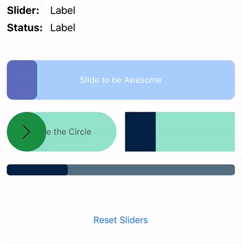

# JaneSliderControl
## Overview
The JaneSliderControl is a UIControl subclass that can be customized to fit the style of your app.  It provides feedback for starting the slide, progress while sliding, canceling the slide and finishing the slide.

## Swift Version
For using swift version `3.0`, tags `0.2.*`  
For using swift version `2.3`, tags `0.1.*`

## Setup
### Install using Cocoapods (recommended)
1. Add `JaneSliderControl` to your podfile and run `pod install`
2. Add a JaneSliderControl to your `UIViewController` either programmatically or using storyboards.
3. Add one or more of the `IBActions` listed in the Features section below

> To install without Cocoapods, add the `SliderControl.swift` file found in `JaneSliderControl/SliderControl/` then follow steps 2 and 3.

## Features
### IBActions
You can use the following IBActions with the JaneSliderControl:

|IBAction|Description|
|---|---|
|`.EditingDidBegin`|User has started sliding|
|`.ValueChanged`|User is sliding the control|
|`.PrimaryActionTriggered`|User finished sliding the control.   (Note: this only works on iOS 9 and above)|
|`.EditingDidEnd`|User finished sliding the control.   (Note: use in place of `.PrimaryActionTriggered` if you target a version of iOS below 9.0)|
|`.TouchCancel`|User did not finish sliding the control|

### Customize
The control has the following properties to customize the look of the slider control.  They all have the IBInspectable tag, though IB does not currently support all the types used, so some items will have to be set programmatically.

> Note: in the descriptions below, we are calling the part of the slider control that slides over top the background "slider", the part that the slider slide over the "background", and the complete control is just called the "control"

|Variable|Can Set in IB|Description|
|---|:---:|---|
|sliderColor|**Yes**|The color of the slider|
|textColor|**Yes**|The color of the background text|
|cornerRadius|**Yes**|The corner radius for both the control and the slider|
|sliderText|**Yes**|The text that goes over the background|
|sliderWidth|**Yes**|The width of the slider (not the control)|
|sliderImage|**Yes**|An optional image to go on the slider.  The image will stick to the in of the slider as it slides|
|sliderImageContentMode|No|ContentMode for the sliderImage|
|sliderFont|No|The font for the sliderText|

### Other Properties
The slider also has a read only property called `progress` that tells you the progress of the slider as it slides.  The values range from 0 to 1.

## License
This project is made available with the MIT License.

## Feedback
If you have any issues or feature request for this project, please create an issue and/or send us a pull request.

We hope you enjoy the JaneSliderControl!
